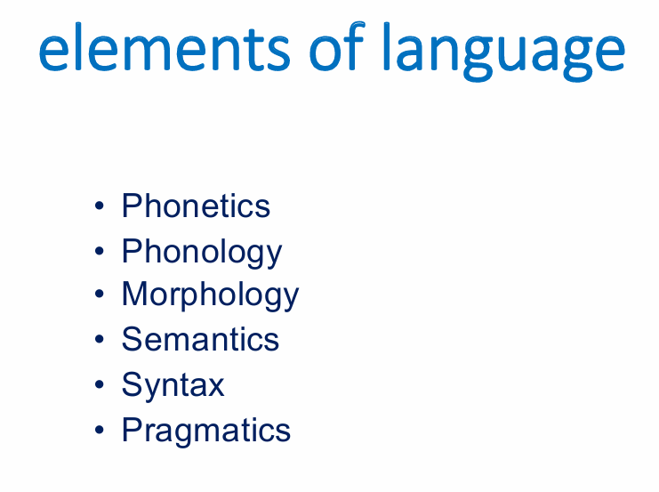

# Terms and Concepts
## Terms in Linguistics
* logogram: a symbol represents a word or phrase. concrete nouns and verbs.
* phonogram: a symbol represents a sound or syllable.
  * homophonous word, rebus principle
  * phoneme, acrophonic principle
* ideogram: mute signs added classificatory elements.
* morpheme <n.>, smallest unit of meaning similar to word, that word can be divided into.
* grapheme <n.>, smallest unit of meaning.
  * allograph <n.>, a variant form of grapheme.
    * diacritic <n.>, a mark placed on a letter.
* phoneme <n.>, smallest unit of speech.
* semantic <adj.>, connected with the meaning.
* phonetic <adj.>, connected with the sound.
* syllabary <n.>, a set of characters representing syllables.
* orthography <n.>, the system of spelling.
  
## Theory about Origin of Writing
* pictographic theory
  * pictograms (pictograph)
  * complex symbols representing sounds and words.
* token theory
  * clay tokens: a system of counting and record-keeping 
  * clay tablet
  * earliest script
## Earlier Writing Systems
* Sumerian cuneiform, Sumerian glyph.
* Oracle bone inscription.

## Principle of Writing Evolution
* rebus principle: use existing symbols to represent a similar sounding morpheme unrelated.
  * Sumerian cuneiform
  * oracle bone inscription
* acrophonic principle: take the symbol of an object to represent the **initial** sound.
  * Egyptian hieroglyph
  * Maya script
* extension and differentiation
  
## Categories of Writing System
* semasiographic, ideas and meaning only.
* glottographic, bound to language.
  * logographic, incorporate sound on the level of morpheme.
    * Chinese
    * Egyptian
    * Mayan
    * Sumerian
  * phonographic, represent sound only
    * syllabic, represent sound on the level of syllables. Graph represents a syllable
      * Japanese kana system.
        * kanji, kokuji
        * hiragana
        * katakana
    * segmental, represent sound on the level of individual sounds (consonants and vowels).
      * abjad, with mostly consonants
        * Egyptian hieroglyphic writing
        * Hebrew
        * Arabic
        * Phoenician
      * abugida, with vowels indicated
        * Indian Devanagari script
          * Hindi
          * Sanskrit
          * Marathi
          * Nepali
      * alphabet, consonants + vowels, grapheme to phoneme correspondence.
        * Roman script
          * Finnish
          * Greek
          * Italian
          * Spanish
          * German
          * French
          * Danish
          * English
        * Cyrillic script
          * Russian
          * Ukrainian
          * Bulgarian
          * Serbian
        * Other script
          * Georgian
          * Armenian
          * Korean
      
## Decipherment of Hieroglyphs
* ancient Egypt
* from 3200 BCE to 400 CE
* Greek for official documents while Egyptian hieroglyphs for religious, literary and scientific texts.
* Rosetta Stone
  * Hieroglyphic, for gods and priests.
    * a mixture of:
      * phonogram
      * logogram
      * ideogram (determinative)
    * evolution
      * Hieroglyphic text
      * Hieratic
      * Demotic
      * Coptic
  * Demotic, for populace.
  * Greek, for the administration.
  * 1798, Egyptian Campaign led by Napoleon.
    * three-year
    * to disrupt British trade route to India
    * Discovery of Rosetta Stone
  * Displaying in British Museum
  * protagonists
    * Champollion
    * Young
  * Relationship between symbol count and script type
    * lower than 20: consonantal abjad
    * 20 to 30 symbols: a phonetic alphabet
    * 30 to 90: syllabary
    * higher than 90: a logographic system
  
## Decipherment of Linear B
* Process
  * building the grid: Alice Kober
  * expending with data: Emmett Bennett
  * assigning sound values: Michael Ventris
  * supporting refining and documenting: John Chadwick
* Facts
  * borrowed from Minoan civilization
  * to write Mycenaean Greek

## Literacy and Society
* romanization: represent sound using phonetic alphabet
  * Matteo Ricci
  * Wade-Giles system
  * Qieyinzi
  * Zhuyin Zimu
  * Gwoyeu Romatzyh
  * Latinized New Script
  * Hanyu Pinyin
* simplification

# Review for Quiz

* Phonetics (science of speech sounds) (**microscopic**)
  * Phonology (study of the patterns of sounds) (**macroscopic**)
    * phoneme/segment
      * consonant
      * vowel
    * syllable=$\Sigma$phonemes
* morphology/morphological
  * grapheme (can be without meaning)
  
  * morpheme (has meaning)
    * affix
      * prefix
      * suffix
    * stem
  * word = $\Sigma$morphemes
* semantics (science of the meanings in language)
* syntax/syntactic (study of sentence patterns of language)
* pragmatics
* writing systems
  * pictographic
  * ideographic
  * morphographic/logographic
  * phonographic
    * syllabic
    * segmental
      * abjad
      * alphabet
      * abugida

